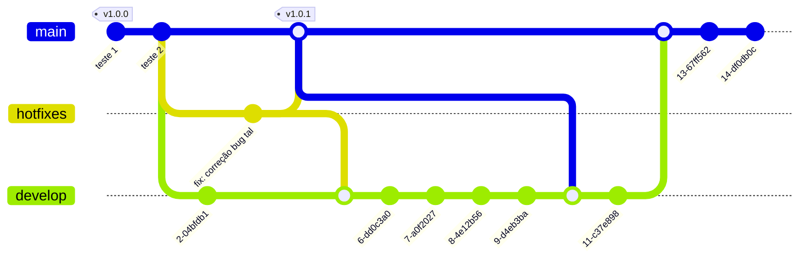

```mermaid
gitGraph
    commit id: "teste 1" tag: "v1.0.0"
    commit id: "teste 2"
    branch hotfixes
    branch develop
    checkout develop
    commit
    checkout hotfixes
    commit id: "fix: correção bug tal"
    checkout main
    merge hotfixes tag: "v1.0.1"
    checkout develop
    merge hotfixes
    commit
    commit
    commit
    commit
    merge main
    commit
    checkout main
    merge develop
    commit
    commit
```
